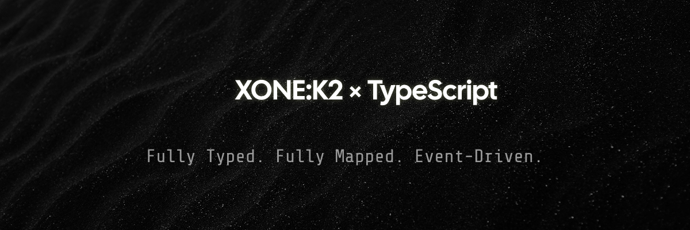

<p align="center">
  
</p>

# Allen&Heath K2 MIDI Controller Library 🎛️

> ⚠️ **Work In Progress**: This library is currently under active development and not yet published. Star the repository to stay updated!

[](https://opensource.org/licenses/MIT)
[](http://makeapullrequest.com)
[]()

A lightweight TypeScript wrapper for the Allen&Heath K2 MIDI controller designed with creative developers and new media artists in mind. Transform your K2 into an intuitive interface for interactive installations, live performances, generative art, and creative coding projects.

## Objective

The Allen&Heath K2 MIDI Controller Library aims to provide an intuitive interface for developers and artists working with the K2 controller. By abstracting away the complexity of MIDI communication and hardware mapping, this library allows you to focus on creating amazing interactive experiences rather than dealing with technical details.

Key objectives:
- Allow to use K2 by intuition. You don't have to remember any MIDI Notes or open K2 documentation to handle control change or highlight button again. This library makes all of that for you. All controls are mapped and tested.
- Provide a clean, type-safe API that makes working with the K2 controller feel natural and straightforward
- Support all K2 hardware features including buttons, knobs, faders, and LED feedback
- Enable both direct control and mapping-based approaches to suit different use cases
- Make the K2 controller accessible to creative developers and artists without requiring deep MIDI knowledge

## Official Resources 📚

- [Xone:K2 Product Page](https://www.allen-heath.com/hardware/xone-series/xonek2/)
- [Xone:K2 Resources](https://www.allen-heath.com/hardware/xone-series/xonek2/resources/)
- [Xone:K2 User Guide](https://www.allen-heath.com/content/uploads/2023/06/XoneK2_UG_AP8509_3.pdf)


## Development Status 🚧

This project is in active development. Current implementation status:

### Implemented Features ✅
- Complete hardware mapping for all K2 controls:
  - 36 buttons
  - 12 knobs
  - 4 faders
  - 6 encoders
  - 32 LEDs (red, green, amber)
- MIDI message translation layer
- Event-based API for all controls
- TypeScript support with full type definitions
- Unit tests for all hardware mappings
- Browser MIDI API integration
- Example implementations for vanilla JS and Svelte

### In Progress 🚧
- WebMIDI support improvements
- Additional example implementations
- Documentation improvements

### Planned Features 📋
- Multiple controller support

You can:
- ⭐ Star the repository to show your interest
- 🐛 Open issues to suggest features or report bugs
- 🤝 Contribute to the development
- 👀 Watch the repository for updates

The installation instructions and examples in this README represent the planned API. The actual implementation is still in progress.

## Features 🚀

- 🎯 Human-readable interface for K2 controls (buttons, knobs, faders, LEDs)
- 🔄 Automatic MIDI note/command translation
- 🎨 Easy-to-use API for handling control changes
- 🏭 Factory function pattern for flexible instance creation
- 🎹 Support for all K2 controls and LEDs
- 🔌 Built on top of WebMIDI API
- 🌐 Environment agnostic - works in browser and Node.js
- 🔌 Flexible MIDI provider system - use any MIDI implementation that follows the MIDIProvider interface

## Environment Agnostic Design 🌐

The library is designed to be environment agnostic, meaning it works seamlessly in both browser and Node.js environments. This is achieved through a flexible MIDI provider system:

```typescript
// Example of using BrowserMIDI provider (default for browser)
import { createK2Controller, BrowserMIDIProvider } from 'k2';

const k2 = createK2Controller({
  channel: 1,
  provider: new BrowserMIDIProvider()
});

// Example of using a custom MIDI provider
import { createK2Controller } from 'k2';
import { MIDIProvider } from 'k2/interfaces';

class CustomMIDIProvider implements MIDIProvider {
  // Implement required MIDI interface methods
  // This could be WebMIDI.js, node-midi, easy-midi, or any other MIDI implementation
}

const k2 = createK2Controller({
  channel: 1,
  provider: new CustomMIDIProvider()
});
```

This design allows you to:
- Use the library in any JavaScript/TypeScript environment
- Inject your own MIDI implementation for testing
- Switch between different MIDI backends without changing your application code
- Use the library with various MIDI implementations (WebMIDI, WebMIDI.js, node-midi, easy-midi, etc.)

## Roadmap 🗺️

### Current Features
- ✅ Basic MIDI input/output handling
- ✅ Event-based API
- ✅ LED control
- ✅ Hardware controls mapping

### Coming Soon
- 🚧 Full WebMIDI support
- 🚧 Multiple controller support

### Future Ideas
- 💡 Built-in translation layers for popular creative coding frameworks
- 💡 Visual configuration tool
- 💡 OSC protocol bridge
- 💡 MIDI clock sync utilities
- 💡 Integration with popular DAWs

## Installation 📦

```bash
# npm
npm install k2

# yarn
yarn add k2

# pnpm
pnpm add k2

# bun
bun add k2
```

## Usage Examples 🎮

K2 can be used in two ways: Direct Mode and Mapping Layer. Choose the approach that best fits your needs.

### Direct Mode 🔧

Direct mode gives you immediate access to K2's controls and events. Perfect for prototyping or when you need fine-grained control.

```javascript
import { createK2Controller } from 'k2';

// Initialize controller with MIDI channel (1-16, default: 1)
const k2 = createK2Controller({ channel: 1 });

// Wait for MIDI connection
k2.connect().then(() => {
  // Direct control of buttons and LEDs
  k2.on('button1.press', () => {
    console.log('Button 1 was pressed!');
    k2.led.button1.on();
  });

  // Direct knob handling
  k2.on('knob1.change', (value) => {
    console.log(`Knob 1 value: ${value}`);
  });

  // Direct fader control
  k2.on('fader1.change', (value) => {
    console.log(`Fader 1 position: ${value}`);
  });
});
```

### Mapping Layer 🔄

Mapping Layer allows you to define control mappings in configuration files, making it easy to switch between different setups or applications. Perfect for DAWs, live performances, or any scenario requiring flexible mappings.

#### 1. Define Your Mappings

```json
{
  "name": "My DAW Setup",
  "controls": {
    "button1": {
      "action": "transport.play",
      "feedback": "transport.isPlaying"
    },
    "button2": {
      "action": "transport.stop"
    },
    "knob1": {
      "action": "mixer.track1.volume",
      "range": [0, 100]
    },
    "fader1": {
      "action": "mixer.master.volume",
      "range": [-Infinity, 6]
    }
  },
  "feedback": {
    "led.button1": "transport.isPlaying",
    "led.button2": "transport.isRecording"
  }
}
```

#### 2. Create Mapping Layer

```javascript
import { createK2Controller, createMappingLayer } from 'k2';
import myDawMappings from './daw-mappings.json';

// Create controller and mapping layer
const k2 = createK2Controller();
const dawMapping = createMappingLayer(k2, myDawMappings);

// Connect to your DAW
const daw = connectToDAW();

// Initialize mapping layer with your application
dawMapping.connect({
  // Define how mapped actions should be executed
  actions: {
    'transport.play': () => daw.transport.play(),
    'transport.stop': () => daw.transport.stop(),
    'mixer.track1.volume': (value) => daw.mixer.setTrackVolume(1, value),
    'mixer.master.volume': (value) => daw.mixer.setMasterVolume(value)
  },
  // Define how to get state for LED feedback
  state: {
    'transport.isPlaying': () => daw.transport.isPlaying(),
    'transport.isRecording': () => daw.transport.isRecording()
  }
});

// Start the mapping layer
dawMapping.start();
```

#### 3. Handle State Changes

The Mapping Layer automatically:
- Routes K2 control changes to your mapped actions
- Updates K2 LEDs based on your application's state
- Handles value scaling and range mapping
- Manages bidirectional communication

```javascript
// Your application can update state anytime
daw.on('playStateChanged', (isPlaying) => {
  // Mapping layer automatically updates K2 LEDs
  dawMapping.updateState('transport.isPlaying', isPlaying);
});
```

#### Example Mapping Configurations

##### Live Performance Setup
```json
{
  "name": "Live Performance",
  "controls": {
    "button1": { "action": "scene.next" },
    "button2": { "action": "scene.previous" },
    "knob1": { "action": "effects.delay.time" },
    "fader1": { "action": "master.intensity" }
  }
}
```

##### Video Effects Setup
```json
{
  "name": "Video Effects",
  "controls": {
    "knob1": { 
      "action": "video.blur",
      "range": [0, 20]
    },
    "fader1": { 
      "action": "video.opacity",
      "range": [0, 1],
      "curve": "exponential"
    }
  }
}
```

## API Reference 📚

### Controller Creation
```typescript
interface K2Options {
  channel: number;  // MIDI channel (1-16)
}

const k2 = createK2Controller({ channel: 1 });
```

### Available Controls

K2 provides arrays of available controls to help you build settings UI:

```typescript
import { K2_CONTROLS } from 'k2';

console.log(K2_CONTROLS);
// {
//   buttons: ['button1', 'button2', 'button3', 'button4', 'button5', 'button6'],
//   knobs: ['knob1', 'knob2', 'knob3', 'knob4', 'knob5', 'knob6'],
//   faders: ['fader1', 'fader2', 'fader3'],
//   leds: ['led1', 'led2', 'led3', 'led4', 'led5', 'led6']
// }
```

### Building Settings UI

K2 makes it easy to build settings UI for your DAW or application. Here's an example of implementing MIDI learn functionality:

```typescript
import { createK2Controller, K2_CONTROLS } from 'k2';

// Create your settings component
function MidiMappingSettings({ onSave }) {
  const [mappings, setMappings] = useState({});
  const [learning, setLearning] = useState(null);
  
  // Initialize K2
  const k2 = createK2Controller({ channel: 1 });
  
  // Start MIDI learn for a specific action
  const startMidiLearn = (action) => {
    setLearning(action);
    
    // Listen for any control change
    const listeners = [];
    
    // Add listeners for all controls
    K2_CONTROLS.buttons.forEach(button => {
      listeners.push(k2.on(`${button}.press`, () => {
        setMappings(prev => ({
          ...prev,
          [action]: { type: 'button', control: button }
        }));
        stopLearning();
      }));
    });
    
    K2_CONTROLS.knobs.forEach(knob => {
      listeners.push(k2.on(`${knob}.change`, () => {
        setMappings(prev => ({
          ...prev,
          [action]: { type: 'knob', control: knob }
        }));
        stopLearning();
      }));
    });
    
    // Store listeners for cleanup
    setActiveListeners(listeners);
  };
  
  // Stop MIDI learn
  const stopLearning = () => {
    setLearning(null);
    activeListeners.forEach(listener => listener.remove());
  };
  
  return (
    <div className="midi-settings">
      <h2>MIDI Mappings</h2>
      
      {/* Transport Controls */}
      <div className="mapping-group">
        <h3>Transport</h3>
        <MappingRow
          label="Play/Pause"
          action="transport.playPause"
          mapping={mappings['transport.playPause']}
          onLearn={() => startMidiLearn('transport.playPause')}
        />
        <MappingRow
          label="Stop"
          action="transport.stop"
          mapping={mappings['transport.stop']}
          onLearn={() => startMidiLearn('transport.stop')}
        />
      </div>
      
      {/* Mixer Controls */}
      <div className="mapping-group">
        <h3>Mixer</h3>
        <MappingRow
          label="Master Volume"
          action="mixer.master"
          mapping={mappings['mixer.master']}
          onLearn={() => startMidiLearn('mixer.master')}
        />
      </div>
      
      <button onClick={() => onSave(mappings)}>Save Mappings</button>
    </div>
  );
}

// Helper component for each mapping row
function MappingRow({ label, action, mapping, onLearn }) {
  return (
    <div className="mapping-row">
      <span>{label}</span>
      <span>{mapping ? `${mapping.type}: ${mapping.control}` : 'Not mapped'}</span>
      <button onClick={onLearn}>Learn</button>
    </div>
  );
}
```

### Using the Mappings

Once you have the user's mappings, you can create a mapping configuration:

```typescript
// Convert UI mappings to K2 mapping configuration
function createMappingConfig(uiMappings) {
  const config = {
    name: "User DAW Setup",
    controls: {},
    feedback: {}
  };

  // Convert each mapping to control configuration
  for (const [action, mapping] of Object.entries(uiMappings)) {
    // Set up control mapping
    config.controls[mapping.control] = {
      action: action
    };

    // Add specific settings based on control type
    if (mapping.type === 'button') {
      config.controls[mapping.control].feedback = `${action}.active`;
      config.feedback[`led.${mapping.control}`] = `${action}.active`;
    }

    if (mapping.type === 'knob' || mapping.type === 'fader') {
      config.controls[mapping.control].range = [0, 127];
    }
  }

  return config;
}

// Example usage
const mappings = {
  'transport.play': { type: 'button', control: 'button1' },
  'mixer.volume': { type: 'knob', control: 'knob1' }
};

const userMappings = createMappingConfig(mappings);
const k2 = createK2Controller({ channel: 1 });
const dawMapping = createMappingLayer(k2, userMappings);

// The resulting configuration will be:
// {
//   name: "User DAW Setup",
//   controls: {
//     button1: {
//       action: "transport.play",
//       feedback: "transport.play.active"
//     },
//     knob1: {
//       action: "mixer.volume",
//       range: [0, 127]
//     }
//   },
//   feedback: {
//     "led.button1": "transport.play.active"
//   }
// }
```